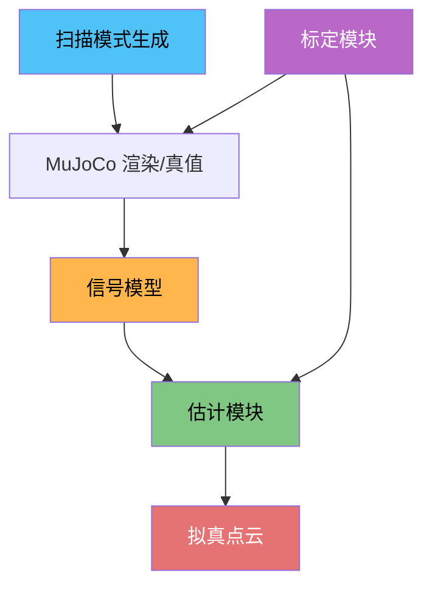

# LiDAR Toolkit

[](https://www.python.org/)
[](LICENSE)
[](https://numpy.org/)

在MuJoCo-LiDAR仓库的基础上添加噪声模型，以及记录了一些学习时看到的标定方法和估计方法。
LiDAR 信号处理工具包：标定、信号建模、估计与拟真仿真。

## 功能概览



| 模块 | 说明 |
|------|------|
| **`calibration`** | 内参/外参标定、反射率标定、时间同步 |
| **`signal_model`** | 大气衰减、探测器噪声、反射率模型 (BRDF)、波形生成 |
| **`estimation`** | 深度估计 (CFD/峰值/重心/前沿)、角度估计、强度标定 |
| **`scan_gen`** | Livox / Velodyne / Ouster 等扫描模式生成 |
| **`lidar_sim`** | 拟真仿真器，串联完整噪声管线 |

## 依赖

```
- **Python** ≥ 3.10
- **NumPy** ≥ 1.20.0
- **MuJoCo** ≥ 3.2.0 (可选，用于仿真和测试).
```

## 快速开始

### 1. 扫描模式生成

```python
from lidar_toolkit import LivoxGenerator

# 加载 Livox Mid-360 扫描模式
gen = LivoxGenerator("mid360")
theta, phi = gen.sample_ray_angles(downsample=4)  # 下采样 4 倍
print(f"射线数: {len(theta)}")
```

支持的 LiDAR 型号：`avia`, `HAP`, `horizon`, `mid360`, `mid40`, `mid70`, `tele`

传统旋转式激光雷达：

```python
from lidar_toolkit import generate_HDL64, generate_vlp32, generate_os128, generate_airy96

theta, phi = generate_HDL64(f_rot=10.0, sample_rate=1.1e6)
```

### 2. 信号建模

```python
from lidar_toolkit import AttenuationModel, LidarNoiseModel, WaveformModel

# 大气衰减
atm = AttenuationModel(peak_power=50.0, aperture_diameter=0.02)
pr = atm.received_power(reflectance=0.5, distances=10.0)

# 探测器噪声
noise = LidarNoiseModel(detector_type="APD", dark_count_rate=1e4)
photons = atm.power_to_photons(pr, pulse_width=5e-9)
electrons = noise.apply(photons, t_gate=5e-9)

# 波形生成
wf = WaveformModel(pulse_width=5e-9, sampling_rate=2e9)
t, waveform = wf.generate(amplitude=electrons)
```

### 3. 深度估计

```python
from lidar_toolkit import DepthEstimator, peak_tof, cfd_tof

# 从波形估计飞行时间
t_tof = peak_tof(t, waveform)       # 峰值检测
# t_tof = cfd_tof(t, waveform)      # 恒比鉴别
# t_tof = centroid_tof(t, waveform) # 重心法

depth_estimator = DepthEstimator(method="peak")
depth = depth_estimator(t, waveform)  # → 距离 (m)
```

### 4. 标定

```python
from lidar_toolkit import IntrinsicCalibrator, ExtrinsicCalibrator, icp, solve_hand_eye_ax_xb

# 内参标定（平面靶标法）
calib = IntrinsicCalibrator(n_channels=64, theta_nominal=theta)
calib.calibrate_delta_theta(distances, theta, phi, poses)

# 外参标定 (ICP + 手眼标定)
R, t = icp(source_points, target_points)
R_x, t_x = solve_hand_eye_ax_xb(A_matrices, B_matrices)
```

### 5. 拟真仿真（MuJoCo 集成）

```python
from lidar_toolkit import LidarSim, LidarSimConfig
from mujoco_lidar import MjLidarWrapper

# 配置仿真参数
cfg = LidarSimConfig(
    lidar_model="mid360",
    downsample=4,
    range_noise_sigma=0.02,
    drop_prob=0.02,
    depth_method="peak",
)

# 创建仿真器
lidar_wrapper = MjLidarWrapper(model, "lidar_site", backend="cpu")
sim = LidarSim(lidar_wrapper, cfg)

# 执行扫描
mujoco.mj_forward(model, data)
pcd = sim.scan(data)  # → (N, 6): [x, y, z, intensity, ring, time]
```

## 项目结构

```
lidar-toolkit/
├── src/lidar_toolkit/
│   ├── __init__.py              # 统一导出接口
│   ├── lidar_sim.py             # 拟真仿真器
│   ├── scan_gen.py              # 扫描模式生成
│   ├── calibration/
│   │   ├── intrinsic.py         # 内参标定
│   │   ├── extrinsic.py         # 外参标定 (ICP + 手眼标定)
│   │   ├── reflectivity_calib.py # 反射率标定
│   │   └── time_sync.py         # 时间同步
│   ├── estimation/
│   │   ├── depth_estimation.py  # 深度估计 (CFD/峰值/重心/上升沿)
│   │   ├── angle_estimation.py  # 角度噪声估计
│   │   └── intensity.py         # 强度标定
│   ├── signal_model/
│   │   ├── attenuation.py       # 衰减模型
│   │   ├── noise_model.py       # 探测器噪声
│   │   ├── reflectivity.py      # 反射率模型 (BRDF)
│   │   └── waveform.py          # 波形生成
│   └── scan_mode/               # 预存扫描模式 (.npy)
│       ├── mid360.npy
│       ├── avia.npy
│       └── ...
├── examples/
│   ├── calibration_in_mujoco.py
│   ├── depth_estimation_in_mujoco.py
│   ├── lidar_policy_demo.py
│   └── mujoco_lidar_sim.py
├── tests/
│   └── test_quantitative.py     # 定量对比测试
└── pyproject.toml
```

#

## 运行示例

```bash
# 拟真仿真 + 策略推理
python examples/lidar_policy_demo.py --scene go2 --onnx go2_policy.onnx

# MuJoCo 中的 LiDAR 仿真
python examples/mujoco_lidar_sim.py

# MuJoCo 中的标定
python examples/calibration_in_mujoco.py
```